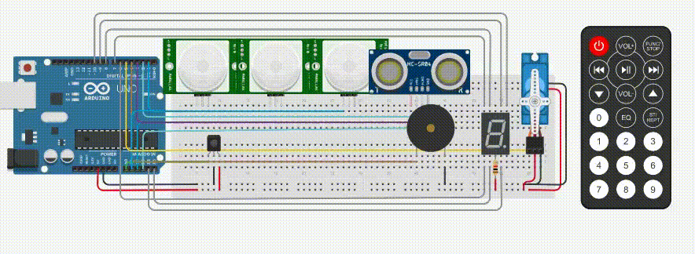

<body topmargin= 40 leftmargin=50 rightmargin= 50>

  

## Projeto Final - IoT

  
<i>Protótipo de sistema de alarme e abertura de portas automatico.</i>

  

  

- [Link para o Projeto](https://www.tinkercad.com/things/edtO0B6zriS-exercicio-avaliativo-23112020-realdo-jutino-junior-e-eduardo/editel?sharecode=5gFtY8cCk_NJNpZ1Y0muAMv_UEUfK3KsLeTV1-j_lp0)

## :exclamation: Objetivo 
Criar um sistema no Arduino que permita a ativação de um alarme que possui diferentes modos, e tambem um sistema de abertura de portas a distancia utilizando um sensor de distancia.

   

## :speech_balloon: Descrição do Projeto
O projeto consiste em criar um sistema de alarme e um sistema de abertura de portas, que utilizara de sensores de movimento e sensores de distância,  os sensores de movimento através de movimentação permitiram diferenciar um ser humano de um animal doméstico, assim não ativando o alarme de forma desnecessária, e também conta com um sensor que ativara independe da altura do objeto que passar na frente, permitindo que o usuário mude o tipo de alarme de acordo com suas necessidades, o sistema de alarme que é ativado pela altura do objeto se utilizara de dois sensores, que caso apenas o sensor de baixo seja ativado isso significa que um animal domestico passou na frente dele, mas caso os 2 sensores tanto o inferior quanto o superior sejam ativados, isso significa que um ser humano passou na frente e ele soara o piezo, já o sensor de distância que trabalha sozinho apenas soara quando algo passar na frente.    
	O sistema de abertura de porta servira abrir as portas internas da casa automaticamente usando o sensor de distância ultrassônico que permitira medir a distância da pessoa ate o sensor e determinar se deve ou não abrir a porta. Ambos os sistemas serão ativados pelo controle infravermelho remoto, e através do visor de sete segmentos será possível ver se o alarme está ativado ou desativado.
   

## :floppy_disk: Componentes Utilizados
- Sensores PIR 
- Sensor de distância ultrassônico HC-SR04  
- Sensor Infravermelho  
- Arduino Uno R3  
- Placa de ensaio  
- Infravermelho remoto 
- Visor de 7 segmentos  
 

   

  

  

##  :office:Sobre
Projeto realizado e apresentado ao Curso de Técnico de Informática da SATC – Associação
Beneficente da Indústria Carbonífera de Santa Catarina

 ## :busts_in_silhouette: Desenvolvedores 
 
- [Eduardo Sazan](https://github.com/Saz0n)

- [Realdo Justino Júnior](https://github.com/Realdo-Justino)

